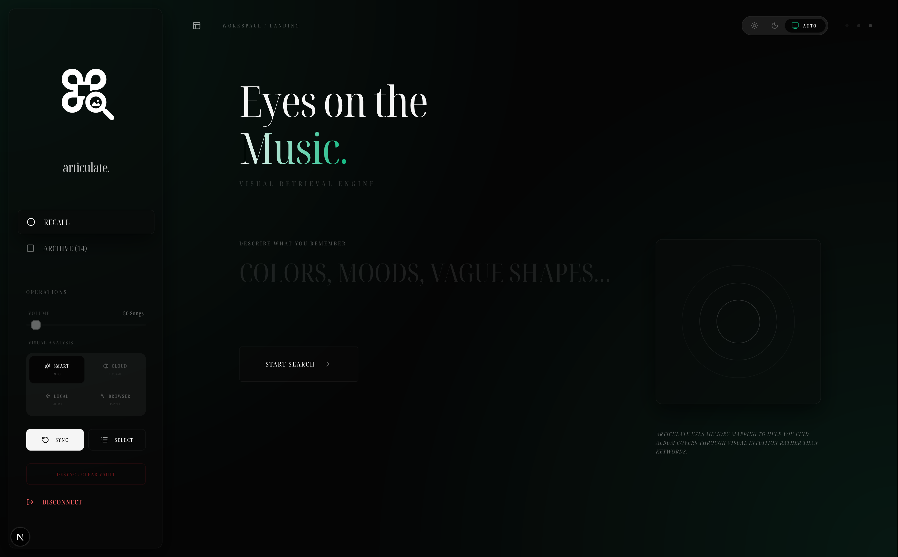

# Articulate

## Overview
Articulate (Music, *"articulated"* through art) is an AI-powered semantic search engine and visual archive for personal music libraries. It solves a fundamental friction point for visual-oriented listeners: the inability to retrieve music based on the memory of its artwork. By bridging the gap between visual recall and digital metadata, Articulate allows users to find songs in their Spotify library by describing the aesthetic, mood, and composition of album covers.

## The Problem
For many, music is indexed visually. When a listener recalls a track, the mind often surfaces the colors, imagery, and "vibe" of the cover art before the artist's name or song title. Traditional music platforms are built exclusively for factual metadata retrieval (Artist, Album, Title), creating a "discovery gap." If a user cannot recall the text, they are relegated to manually sifting through thousands of tracks. This disconnects the user from their own music history.

## The Solution
Articulate transforms a static collection of album covers into a searchable, high-dimensional vector space. By leveraging Large Language Models (LLMs) and advanced Vision models for computer vision, alongside local embedding engines for semantic search, it enables natural language retrieval of visual assets. Users can now "articulate" what they see in their mind's eye to instantly retrieve the music they want to hear.

## Visual Walkthrough & New UI Overhaul

The interface now focuses on high-contrast dark aesthetics, refined typography using Noto Serif Display Condensed, and immersive ambient lighting.


### 1. Immersive Focus Mode & Natural Search
The sidebar can now be retracted to enter **Immersive Mode**, expanding the main canvas to fill the screen with edge-to-edge content and atmospheric corner glows. The language has been humanized—moving away from technical jargon to intuitive, memory-focused prompts like "Describe what you remember" and "Start Search."
<video controls src="Screen Recording 2026-05-19 at 02.46.19.mov" title="Immersive Focus Mode Demo"></video>

### 2. Selective Indexing Vault
You now have total surgical control over what enters your archive. The new **Selective Sync** feature opens a full-screen, high-fidelity modal displaying your entire Spotify library. It grayscales covers already in your archive, allowing you to hand-pick specific albums for neural synthesis, processing them in batches of your choosing.
<video controls src="Screen Recording 2026-05-19 at 02.50.07.mov" title="Selective Indexing Demo"></video>

### 3. Dynamic Visual Analysis & Contender Animation
During the "Questioning" phase, the search experience is completely tactile. A new **Contenders Panel** shows the top potential matches animating into view using elegant spring-loaded entrances. As you provide clues and refine your search, incorrect candidates beautifully blur and fade away while the engine narrows down the visual markers in real-time.


### 4. The Visual Matrix (Semantic Map)
The Archive now features multiple views: Grid, Visual DNA, and the **Visual Matrix (Map)**. The Semantic Map has been completely overhauled from a basic grid to true **Neural Dimensionality Reduction**. Using 384D vector embeddings, covers are clustered based on actual mathematical cosine proximity. Albums with similar aesthetics naturally gravitate toward each other, offering a profound, interactive map of your library's visual DNA.

## Key Features
- **Spotify Library Integration:** Direct authentication via Spotify API to index and search your "Liked Songs."
- **Selective Sync & Limits:** Control exactly which covers are processed and limit synchronization batches to manage API usage.
- **Multiple Engine Strategies:** Choose how your library is indexed:
  - **SMART (Auto):** Seamlessly balances cloud accuracy and local processing.
  - **CLOUD (Accurate):** Uses Groq's latest Llama 4 Scout multimodal flagship.
  - **LOCAL (On-device processing):** Integrates with a local **Ollama** instance (e.g., `llava`) for Groq-level vision analysis using your own GPU—free and unlimited.
  - **BROWSER (Privacy):** Keeps everything strictly within your browser using state-of-the-art WebGPU/WASM models like **Florence-2**.
- **Real-Time Progress Tracking:** Live feedback and percentages during local model downloads and inference.
- **Semantic Vector Search:** Real-time similarity calculations between natural language user descriptions and visual "fingerprints."
- **Privacy-First Inference:** All vector comparisons and search logic are executed locally using Transformers.js.

## Technology Stack
- **Framework:** Next.js (TypeScript)
- **Vision Inference (Cloud):** Groq (Llama-4 Scout)
- **Vision Inference (Local GPU):** Ollama (Llava / Moondream)
- **Vision Inference (Browser):** Transformers.js (Florence-2)
- **Local Neural Engine:** Transformers.js for browser-side embedding generation (`all-MiniLM-L6-v2`)
- **Vector Mathematics:** Cosine Similarity for semantic ranking
- **Authentication:** NextAuth.js
- **API Integration:** Spotify Web API

## Setup and Installation

### Prerequisites
To deploy a local instance of Articulate, you must acquire the following API credentials:
1. **Spotify Developer Portal:** Create a new application to obtain a Client ID and Client Secret.
2. **Groq API:** Required for high-speed remote visual inference.

> **Technical Note on Spotify Authentication:** The Spotify Web API requires a secure HTTPS connection for redirect URIs. For local development, it is highly recommended to use a tunneling service like **ngrok** to provide a public HTTPS URL.
> 
> **CRITICAL:** The URL you use for `NEXTAUTH_URL` must match **exactly** with the "Redirect URIs" configured in your Spotify Developer Dashboard.

### Environment Configuration
Create a `.env.local` file in the project root:
```env
# Deployment
APP_URL=https://your-subdomain.ngrok-free.app
NEXTAUTH_URL=https://your-subdomain.ngrok-free.app

# Spotify Integration
SPOTIFY_CLIENT_ID=your_client_id
SPOTIFY_CLIENT_SECRET=your_client_secret
NEXTAUTH_SECRET=a_secure_random_string

# Vision Providers
GROQ_API_KEY=your_groq_key

# Optional: High-Performance Local Inference via Ollama
OLLAMA_URL=http://localhost:11434/api/generate
OLLAMA_MODEL=llava
```

### Installation
```bash
npm install
npm run dev
```

## Usage Workflow
1. **Authenticate:** Connect your Spotify account to grant read access to your liked tracks.
2. **Select Engine:** Choose your preferred Visual Analysis strategy (Cloud, Local, Ollama, or Browser).
3. **Index:** Use Selective Sync or Auto-Sync to analyze cover art. The system generates a persistent local visual description and vector embedding.
4. **Describe:** Enter a natural language description (e.g., "A minimalist blue cover with a lone figure in the center").
5. **Refine:** Watch the contenders panel update in real-time. If the search space is large, provide additional visual details as prompted by the AI.
6. **Play:** Once a match is confirmed, click to launch the track directly in Spotify.

## Design Philosophy
Articulate is built on the principle of **Augmented Intelligence**. Unlike traditional search engines that require the user to adapt to the machine's textual requirements, Articulate adapts to the user's natural cognitive patterns. The project prioritizes:
- **Human-Centric Retrieval:** Designing for the way humans remember, not just how databases store.
- **Edge-Heavy Computation:** Leveraging the user's local hardware (via Transformers.js or Ollama) to minimize latency and maximize privacy.
- **Transparent Logic:** Providing visual descriptions and semantic maps so the "reasoning" of the neural engine is always clear to the user.

---
*Initially developed as a functional prototype for the Bolt Product Builder Graduate Programme Interview.*
